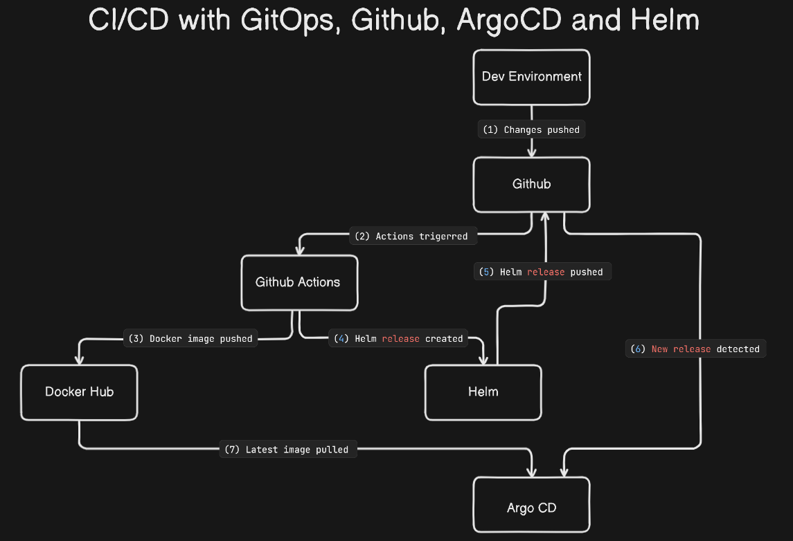
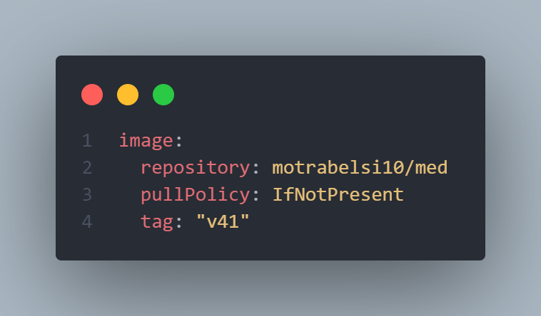
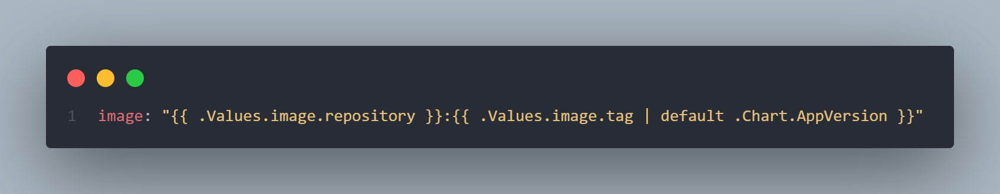
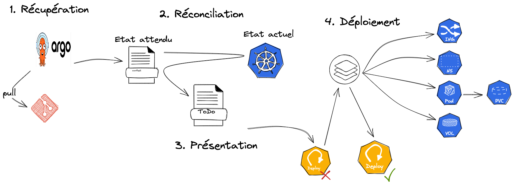
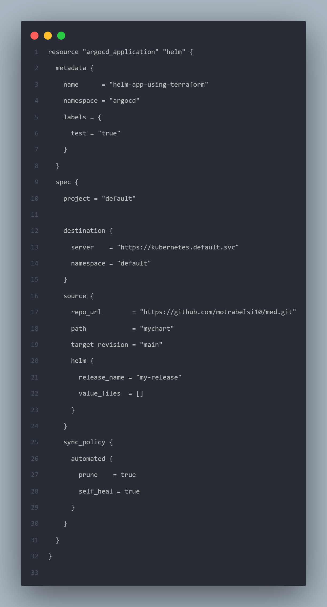

# GitOps: CI/CD using GitHub Actions, Helm and ArgoCD on Kubernetes

Ce projet utilise les outils modernes de déploiement et d'automatisation suivants : Helm, Argo CD et GitHub Actions.
Helm est un gestionnaire de packages pour Kubernetes, facilitant le déploiement et la gestion d'applications dans des clusters Kubernetes via des charts configurables. 
Argo CD est un outil de livraison continue pour Kubernetes, permettant de déployer et de synchroniser automatiquement les applications dans un environnement Kubernetes à partir d'un dépôt Git.
GitHub Actions est utilisé pour automatiser les workflows de build, test et déploiement directement à partir de GitHub.

# GitOps
GitOps est une méthodologie de gestion de l'infrastructure et des applications utilisant Git comme source unique de vérité. Elle implique l'utilisation de Git pour stocker et contrôler la version de tous les fichiers de configuration et le code de l'infrastructure et des applications, puis l'utilisation de l'automatisation pour garantir que l'état du système correspond toujours à l'état désiré défini dans Git. Cette approche permet des déploiements plus rapides et plus fiables, ainsi qu'une collaboration et un contrôle de version plus faciles.

# Pull vs Push

synchroniser l'infrastructure avec le code 

Mode pull => c'est l'infrastructure qui va elle-meme cherher sa configuration sur le dépot Git.

# CI/CD with GitOps, Github Actions, Helm and ArgoCD


# Prérequis
## Helm
1. **Installer Helm**

   Pour installer Helm, suivez ces étapes :

   ```bash
   curl https://baltocdn.com/helm/signing.asc | gpg --dearmor | sudo tee /usr/share/keyrings/helm.gpg > /dev/null
   sudo apt-get install apt-transport-https --yes
   echo "deb [arch=$(dpkg --print-architecture) signed-by=/usr/share/keyrings/helm.gpg] https://baltocdn.com/helm/stable/debian/ all main" | sudo tee /etc/apt/sources.list.d/helm-stable-debian.list
   sudo apt-get update
   sudo apt-get install helm

2. **Créer un Chart**

   Pour créer un nouveau chart avec Helm, exécutez la commande suivante :
   ```bash
   helm create my-chart

3. **Libérer une Version**

   Pour libérer une nouvelle version à partir de votre chart, utilisez la commande suivante :
   ```bash
   helm install my-release ./my-chart -n mynamespace

4. **Explication**

   Une release est une instance installée d'un chart
   helm install my-web-app ./test --namespace testnamespace
   
   - `helm install` : La commande pour installer un chart Helm.
   - `my-release` : Le nom de la release.
   - `./mychart` : Le chemin vers le chart Helm (dans ce cas, le chart `test` que nous avons créé).
   - `-namespace mynamespace` : Le namespace Kubernetes où la release sera installée.

5. **Avantages de Helm**

   Helm permet de déployer des applications Kubernetes complexes en une seule commande
   
   **Configuration centralisée :** Les configurations des applications peuvent être centralisées dans des fichiers `values.yaml` 
   
   Avant Helm, le déploiement d'applications sur Kubernetes nécessitait de gérer manuellement les fichiers de configuration YAML pour chaque ressource Kubernetes (Deployments, Services, ConfigMaps, Secrets, etc.).

6. **Files**

   ***A. Structure du Chart Helm***

            my-chart/

            ├── Chart.yaml

            ├── values.yaml

            ├── charts/

            ├── templates/

            │   ├── deployment.yaml

            │   ├── service.yaml

            │   ├── _helpers.tpl

            │   └── ...

            └── ...


   ***B. Values.yaml***

      Il est utilisé pour définir et personnaliser les valeurs des variables utilisées dans les templates Kubernetes du chart.
      Le fichier values.yaml contient les valeurs par défaut pour les variables de configuration de votre chart Helm. Ce fichier est utilisé pour définir les configurations que vous pouvez personnaliser lorsque vous déployez votre application. Voici un exemple de ce         que vous pourriez trouver dans values.yaml :

      
   
   ***C. Deployment.yaml***

      Le fichier deployment.yaml est un template Kubernetes pour le déploiement de vos applications. Ce fichier utilise les valeurs définies dans values.yaml pour créer les ressources Kubernetes nécessaires. Voici un exemple de deployment.yaml :

      

# ArgoCD 

   1. **Definition**
   
   ArgoCD is a popular open-source GitOps tool for managing Kubernetes applications. It uses a pull-based model to continuously monitor the Git repository for changes and automatically deploy them to the target environment.
   
   Argocd has a controller inside the cluster 
   
   argocd is a pull model

   Argo CD dispose d’une interface utilisateur Web conviviale qui facilite la visualisation et la gestion des applications déployées.

   L’outil permet le déploiement continu d’applications en surveillant les modifications du dépôt de code et en déployant automatiquement les modifications.

   Il prend en charge la gestion des versions, ce qui facilite le suivi des modifications et permet le déploiement de versions spécifiques de l’application.

   Argo CD valide les ressources Kubernetes avant leur déploiement, ce qui garantit la qualité des déploiements et réduit les risques d’erreurs de configuration.

   Enfin, il peut être intégré avec des outils CI/CD pour créer un pipeline complet de déploiement continu.

   - Continious Delivery Tool
   - Déploiements GitOps
   - Interface utilisateur et CLI
   - Gestion de plusieurs clusters
   - Synchronisation automatisée et manuelle
   - faciliter le déploiement et la gestion continus d'applications dans des environnements Kubernetes en utilisant des pratiques GitOps.


   2. **Comment Argo CD fonctionne** 

      

   Le fonctionnement d’Argo CD peut être décrit en quatre étapes principales :

   Récupération du code :
   Argo CD récupère le code source de l’application depuis un dépôt de code Git. Ce référentiel peut être considéré comme la source de vérité : celle qui définit l’état cible (target state) de l’infrastructure.

   Réconciliation :
   Argo CD compare l’état actuel de l’infrastructure avec l’état cible défini dans le référentiel Git. Si des différences sont détectées, Argo CD détermine les actions nécessaires pour synchroniser l’infrastructure réelle avec l’état cible.

      La boucle de réconciliation: 
         Observe :
            Récupérer le contenu du dépôt Git.
            Récupérer l’état de infrastructure.
         Diff :
            Comparer le dépôt avec l’infrastructure.
         Act :
            Réconcilier l’architecture avec le contenu du Git.

   Présentation :
   Argo CD présente les actions à effectuer pour amener l’infrastructure à l’état cible. Cela peut inclure la création ou la suppression de ressources Kubernetes, la mise à jour de la configuration de ces ressources, etc. Les actions sont présentées dans un tableau de bord où l’utilisateur peut les examiner et les approuver ou les rejeter.

   Déploiement :
   Une fois que l’utilisateur a approuvé les actions présentées par Argo CD, celles-ci sont appliquées sur l’infrastructure réelle pour la synchroniser avec l’état cible. Argo CD suit l’état des actions en temps réel et fournit des informations détaillées sur les éventuelles erreurs. L’utilisateur peut également annuler les actions en cours de déploiement si nécessaire.

   ------------------------------------------------------------------------------------------------------------------------------------------------------------------

   ***Auto-Pruning***

   Cette fonctionnalité est très intéressante pour éviter de garder des ressources inutiles dans le cluster. Lors d’une réconciliation, ArgoCD va supprimer les ressources qui ne sont plus présentes dans le dépôt Git.

   Pour l’activer depuis la ligne de commande :

   ```bash
   argocd app set argocd/simple-app --auto-prune
   ```
   Ou depuis le manifest de l’application (à mettre dans le spec de l’application) :

   ```bash
   syncPolicy:
   automated:
      prune: true
   ```

   ***Self-Heal***

   Le self-heal est une fonctionnalité qui permet de réconcilier automatiquement le cluster si une ressource est modifiée manuellement. Par exemple, si un utilisateur modifie un secret, ArgoCD va remarquer cette différence entre le cluster et la source de vérité avant de supprimer ce delta.

   Pour l’activer depuis la ligne de commande :

   ```bash
   argocd app set argocd/simple-app --self-heal
   ```
   Ou depuis le manifest de l’application (à mettre dans le spec de l’application) :

   ```bash
   syncPolicy:
   automated:
      selfHeal: true
   ```      
   ------------------------------------------------------------------------------------------------------------------------------------------------------------------

   Le principe fondamental d’Argo CD est la synchronisation (sync) continue de l’état désiré de l’infrastructure avec son état réel (live state). En d’autres termes, l’outil s’assure que l’état de l’infrastructure correspond en permanence à l’état défini par le code d’infrastructure au sein du dépôt de code (Infra as Code).

   Argo CD gère les applications, qui sont des groupes de ressources Kubernetes définies par un manifeste.
   Chaque application définit sa source, qui peut être soit :

      – Un ensemble de fichier yaml rassemblés au sein d’un dépôt de code git
      – Un chart helm sur un dépôt Helm

   L’état cible (target state) d’une application est l’état souhaité de l’application tel que représenté par le code infrastructure stocké dans le dépôt de code Git, tandis que l’état réel (live state) est l’état actuel de l’application au sein du cluster Kubernetes, comprenant les pods, les services et d’autres ressources.

   Le statut de synchronisation (sync status) indique si l’état réel correspond à l’état cible. Si la synchronisation est requise, Argo CD effectue une opération de synchronisation (sync) pour amener l’application à son état cible en appliquant les modifications nécessaires sur le cluster Kubernetes. Le statut de l’opération de synchronisation indique si la synchronisation a réussi ou échoué.

   Argo CD utilise également une fonction de rafraîchissement (refresh) pour comparer le code le plus récent dans Git avec l’état réel de l’application. Cela permet à Argo CD de détecter les différences et de les résoudre en effectuant une nouvelle opération de synchronisation.

   Enfin, Argo CD surveille la santé de l’application pour s’assurer qu’elle fonctionne correctement et qu’elle puisse traiter les demandes. Le statut de santé (health) indique directement si l’application est fonctionnelle ou non.


   3. **Installation**

   3.1 **With Helm**

   ***Step 1: Add argo cd repo***

   ```bash
      helm repo add argo https://argoproj.github.io/argo-helm
      helm search repo argo
   ```

   ****Step 2: Customize Helm Chart Configuration Values***

   Before deploying you need to update NodePort configurations in the helm chart so that you can access Argo CD UI in the browser, for that use the below command to save the default values of the helm chart in a YML file.

   ```bash
      helm show values argo/argo-cd > values.yaml
      helm fetch argo/argo-cd
      tar -zxvf argo-cd-<version>.tgz
   ```

   ****Step 3: Deploy Argo CD****
   ```bash
      kubectl create namespace argocd
      helm install --values values.yaml argocd argo/argo-cd --namespace argocd
      kubectl get all -n argocd
   ```
   
   ****Step 4: Log in to Argo CD Web UI****

   ```bash
      kubectl port-forward svc/argocd-server -n argocd 8080:443

      kubectl -n argocd get secret argocd-initial-admin-secret -o jsonpath="{.data.password}" | base64 --decode ; echo
   ```


   3.2 **Manuellement**

   ```bash
   kubectl create namespace argocd
   kubectl apply -n argocd -f https://raw.githubusercontent.com/argoproj/argo-cd/stable/manifests/install.yaml
   ```
   
   A. **Download Argo CD CLI**

   ```bash
   brew install argocd
   ```
   
   B. **Access The Argo CD API Server**
   
   ```bash
   kubectl port-forward svc/argocd-server -n argocd 8080:443
   ```

   C. **Login Using The CLI**
    
   ```bash
   argocd admin initial-password -n argocd   
   ```

   Using the username admin and the password from above, login to Argo CD's IP or hostname:

   ```bash
   argocd login <ARGOCD_SERVER>
   ```

   Change the password using the command:

   ```bash
   argocd account update-password
   ```

   4. **Create An Application From A Git Repository**

      ***A. Using Terraform***   
      
      

      
      ***Prérequis***

         Terraform doit être installé et configuré.
         Accès à un cluster Kubernetes avec Argo CD installé.
         Accès à un dépôt Git contenant les fichiers nécessaires pour votre application.

         ***Metadata***
         ****name****: Nom de l'application Argo CD.
         ****namespace****: Namespace où Argo CD est installé.
         ****labels****: Labels optionnels pour l'application.

         ***Spec***
         ****project****: Projet Argo CD sous lequel l'application sera gérée.
         
         ***Destination***
         
         ****server****: URL du serveur API Kubernetes.
         ****namespace****: Namespace cible dans le cluster Kubernetes.

         ***Source***         
         ****repo_url****: URL du dépôt Git contenant le chart Helm.
         ****path****: Chemin dans le dépôt où se trouve le chart Helm.
         ****target_revision****: Branche, tag ou commit Git à utiliser.

         ***Helm***
         ****release_name****: Nom de la release Helm.
         ****value_files****: Liste optionnelle de fichiers de valeu````rs Helm.

         ***Sync Policy***         
         ****prune****: Supprime automatiquement les ressources non définies dans la source.
         ****self_heal****: Synchronise automatiquement l'application si elle diverge de l'état souhaité.

      ***Initialiser et Appliquer la Configuration Terraform***

         ```bash
         terraform init
         terraform plan
         terraform apply
         ```

      ***B. Creating Apps Via UI***
      
      After logging in, click the + New App button as shown below:
      Give your app the name my-app , use the project default, and leave the sync policy as Manual

      Connect the <repo_URL> repo to Argo CD by setting repository url to the github repo url, leave revision as HEAD, and set the path to <Helm_Directory>
      
      For Destination, set cluster URL to https://kubernetes.default.svc (or in-cluster for cluster name) and namespace to default

      After filling out the information above, click Create at the top of the UI to create the my-app application

   5. **Sync (Deploy) The Application**

      The application status is initially in OutOfSync state since the application has yet to be deployed, and no Kubernetes resources have been created. To sync (deploy) the application, run:
      
         ```bash
         argocd app get my-app
         argocd app sync my-app
         ```